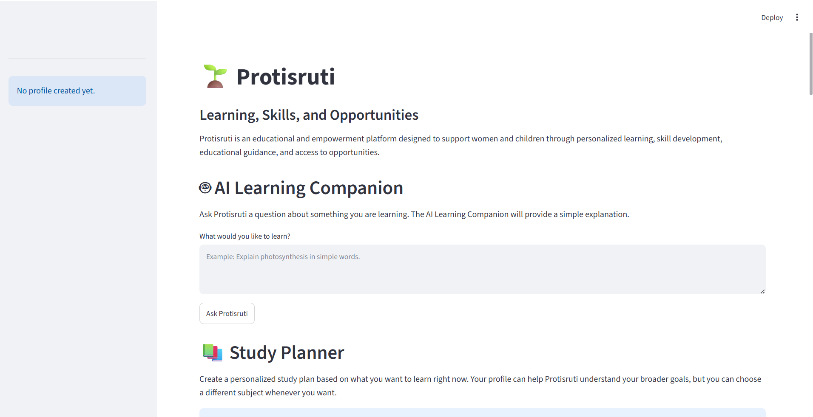

# 🌱 Protisruti

### A Promise of Learning, Opportunity, and Empowerment

Protisruti is an AI-powered educational and empowerment platform designed to support women and children through personalized learning, skill development, educational guidance, and access to opportunities.

The platform combines AI-powered learning assistance with study planning, quizzes, learning resources, user profiles, personalized recommendations, and learning progress tracking.

> 🚧 Protisruti is currently under active development as a functional prototype.

---

## 🎯 Vision

Protisruti aims to make educational guidance and learning support more accessible to women and children, especially for people who may have limited access to personalized tutoring, mentoring, educational resources, or career guidance.

The platform aims to help users:

- Learn new skills
- Set educational goals
- Practice what they learn
- Discover educational and career opportunities
- Track their learning progress
- Build confidence

---

## 💡 Problem

Many women and children face barriers to education and personal development, including:

- Limited access to personalized educational support
- Lack of affordable tutoring or mentoring
- Difficulty finding suitable learning resources
- Limited information about scholarships and educational opportunities
- Lack of personalized career and educational guidance
- Limited access to digital-skills training
- Difficulty creating structured learning plans
- Difficulty tracking learning progress

Protisruti aims to address some of these challenges through an accessible, AI-powered educational platform.

---

## Application Preview

## 🚀 Features

### 1. 🤖 AI Learning Companion

Users can ask educational questions and receive simple explanations through the AI Learning Companion.

The feature is designed to make difficult concepts easier to understand and provide accessible learning support.

### 2. 📚 Personalized Study Planner

Users can create a personalized study plan based on:

- Current learning goal
- Skill level
- Available study time
- Study duration

The study planner helps users organize their learning into a structured plan.

### 3. 📝 Quiz Generator

Users can create and complete practice quizzes based on:

- Subject
- Topic
- Difficulty level
- Number of questions

The quiz system provides:

- Multiple-choice questions
- Automatic scoring
- Percentage scores
- Correct and incorrect answer feedback
- Answer explanations
- Quiz result storage

Current quiz subjects include:

- Python
- Mathematics
- English

### 4. 👤 User Profiles

Users can create a personal Protisruti profile containing:

- Name
- Age group
- User type
- Education level
- Learning interests
- Main learning goal

Users can also load an existing profile using their name.

The profile information helps Protisruti understand the user's learning needs and goals.

### 5. 📊 Learning Progress Tracker

Protisruti stores completed quiz results and allows users to track their learning progress.

The progress section currently provides:

- Number of quizzes completed
- Overall score
- Individual quiz results
- Quiz subject and topic
- Score for each quiz
- Percentage achieved
- Quiz completion date

### 6. 🌸 Resource Center

The Resource Center provides learning and opportunity resources for different areas.

Available categories include:

- 🌸 Women's Education
- 📚 Children's Learning
- 💼 Skills & Career
- 🎓 Scholarships & Opportunities
- 🛡️ Safety & Well-being

Each resource can include:

- Resource title
- Description
- Resource type

### 7. 💡 Personalized Recommendations

Protisruti includes a recommendation component designed to connect users with relevant learning and development opportunities based on their interests and goals.

This feature is being progressively developed as part of the platform's personalization system.

### 8. 💾 SQLite Database

Protisruti uses SQLite for lightweight local data storage.

The database currently supports storing information such as:

- User profiles
- Learning goals
- Quiz results
- Scores
- Quiz completion dates

The database is automatically initialized when the application starts.

---

## 👩 Women and Girls

Protisruti is designed to support women and girls who want to:

- Develop digital skills
- Learn programming
- Improve English and communication skills
- Explore educational pathways
- Explore career options
- Discover scholarships
- Find free learning resources
- Create structured learning plans
- Track their learning progress

The platform aims to make learning and opportunity discovery more accessible and supportive.

---

## 👧 Children and Students

Protisruti is also designed to support children and students who need additional educational assistance.

Potential uses include:

- Asking educational questions
- Understanding difficult concepts
- Practicing academic topics
- Taking quizzes
- Creating study plans
- Tracking learning progress
- Discovering educational resources

Because children are a target user group, additional safety and privacy considerations will be required before real-world deployment involving minors.

---

## 🛠️ Technology Stack

| Technology | Purpose |
|---|---|
| Python | Application development |
| Streamlit | Web application interface |
| SQLite | Database and data storage |
| Pandas | Data processing |
| Scikit-learn | Machine learning and recommendation development |
| AI / LLM API | AI-powered learning assistance |
| Git | Version control |
| GitHub | Source code management |

---

## 📁 Project Structure

Protisruti/
├── app/
│   ├── main.py
│   ├── ai_assistant.py
│   ├── quiz_generator.py
│   ├── resources.py
│   ├── study_planner.py
│   ├── user_profile.py
│   └── recommendations.py
│
├── database/
│   ├── database.py
│   └── protisruti.db
│
├── data/
│
├── tests/
│
├── .gitignore
├── README.md
├── requirements.txt
├── project_plan.md
├── project_features.md
├── technical_requirements.md
└── user_profiles_and_stories.md

> The local SQLite database file is excluded from GitHub using .gitignore.

---

## ⚙️ Installation

### 1. Clone the Repository

    git clone https://github.com/aalam25/Protisruti.git

### 2. Move into the Project Directory

    cd Protisruti

### 3. Create a Virtual Environment

    python -m venv venv

### 4. Activate the Virtual Environment

Windows:

    venv\Scripts\activate

macOS/Linux:

    source venv/bin/activate

### 5. Install Dependencies

    pip install -r requirements.txt

---

## 🔐 Environment Variables

If the AI functionality requires an API key, create a `.env` file in the project root.

Example:

    API_KEY=your_api_key_here

Do not commit your `.env` file to GitHub.

The project `.gitignore` includes:

    .env
    database/protisruti.db
    __pycache__/
    *.pyc

This helps prevent API keys, local database files, and Python cache files from being uploaded to the repository.

---

## ▶️ Running the Application

From the project root directory, run:

    streamlit run app/main.py

Streamlit will start the application and provide a local address that can be opened in a web browser.

---

## 🗄️ Database

Protisruti currently uses SQLite as its local database.

The database contains tables for application data, including:

### Users

Stores user profile information such as:

- Name
- Age group
- User type
- Education level
- Learning goal
- Profile creation time

### Quiz Results

Stores completed quiz information such as:

- User ID
- Subject
- Topic
- Score
- Total questions
- Percentage
- Completion time

The database is created and initialized automatically when Protisruti starts.

The local database file is intentionally excluded from the GitHub repository because it may contain user or application data.

---

## 🔒 Privacy and Data Protection

Protisruti is designed with privacy in mind.

The project aims to:

- Avoid collecting unnecessary personal information
- Keep locally stored application data separate from the public source repository
- Never expose API keys in source code
- Exclude `.env` files from Git
- Exclude the local SQLite database from Git
- Consider additional privacy protections before real-world deployment

The current version is a prototype and should not be considered production-ready for sensitive personal information.

---

## 🧠 Responsible AI and Safety

Because Protisruti is designed to support women and children, responsible AI and user safety are important considerations.

The project aims to:

- Clearly identify AI-generated information where appropriate
- Encourage users to verify important information
- Avoid making high-stakes decisions for users
- Provide educational rather than authoritative advice
- Avoid collecting unnecessary personal information
- Provide safe and supportive educational interactions
- Consider age-appropriate experiences for children
- Add stronger safeguards before deployment involving minors

AI-generated information may sometimes be incorrect. Users should verify important information using reliable sources.

---

## 🎯 Target Users

Protisruti initially focuses on two major user groups.

### Students and Children

Students who need:

- Additional educational support
- Practice opportunities
- Simple explanations
- Study planning
- Learning resources
- Progress tracking

### Women

Women who want to:

- Continue their education
- Develop digital skills
- Learn programming
- Improve English and communication
- Explore career opportunities
- Discover scholarships
- Find free educational resources
- Build structured learning plans

---

## 🌍 Social Impact

Protisruti is intended to create both technical and social impact.

The project aims to help reduce some barriers to learning and opportunity discovery by providing accessible educational support through technology.

Potential impact measurements include:

- Number of users testing the platform
- Number of learning sessions
- Number of quizzes completed
- Learning progress
- User feedback
- User satisfaction
- Educational resources accessed
- Opportunities discovered
- Skills developed

Specific impact targets will be established before broader user testing.

---

## 🔮 Planned Features

Future versions of Protisruti may include:

- 🌐 English and Bangla language support
- 📖 AI Reading Assistant
- 🗣️ English conversation practice
- 🎯 Goal-setting system
- 💡 More personalized resource recommendations
- 📊 Advanced learning analytics
- 🤖 Machine-learning recommendation system
- 🧠 Adaptive learning
- 👨‍👩‍👧 Parent and educator dashboard
- 🎙️ Voice interaction
- 📱 Improved mobile experience
- 📶 Low-bandwidth support
- 🌍 Expanded educational opportunity database
- 📈 Advanced social-impact dashboard

These features will be developed progressively based on technical feasibility, available resources, user feedback, and project impact.

---

## 🧪 Testing

The project includes a `tests` directory for testing application functionality.

Testing will progressively cover important components such as:

- Database operations
- User profile creation
- Quiz functionality
- Quiz result storage
- Study planning
- Recommendations
- AI functionality

More automated tests will be added as development continues.

---

## 📌 Project Status

Protisruti is an ongoing fellowship project and is currently being developed as a functional prototype.

Current development focuses on:

- AI-powered learning assistance
- Personalized study planning
- Quiz generation
- User profiles
- Learning progress tracking
- Educational resources
- Personalized recommendations
- Database integration
- Responsible AI considerations

The project will continue to evolve based on testing, user feedback, technical feasibility, and social-impact goals.

---

## 🤝 Future Contributions

As the project develops, contributions and feedback may help improve:

- Educational content
- User experience
- Accessibility
- AI safety
- Recommendation quality
- Learning analytics
- Multilingual support
- Testing
- Documentation

Contribution guidelines will be added when the project is ready for external contributions.

---

## 📄 License

Protisruti is currently being developed as an educational and fellowship project.

License information will be added as the project moves toward a broader public release.

---

## 👩‍💻 Author

**Abone Alam**

Computer Science Student | AI/ML Learner | Social Impact Project Developer

GitHub: https://github.com/aalam25

---

## 🌱 Protisruti

**A promise of learning, opportunity, and empowerment.**